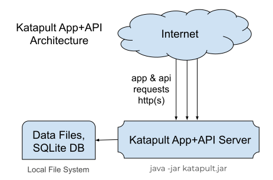
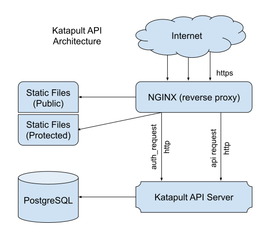

# Katapult

A template project for building API services with support to (optionally) serve an SPA-style static Web app from a single executable `jar`:

- API server built with [Kotlin](https://kotlinlang.org/), [Javalin](https://javalin.io), [Guice](https://github.com/google/guice)
- App built with [Vue](https://vuejs.org/), [Vue-Cli](https://cli.vuejs.org/), [Bootstrap](https://getbootstrap.com)

## Overview

The purpose of this project is to combine a number of useful libraries into a starting stack for other projects.

When built, Katapult provides a single executable `jar` file that can self-serve an API and Vue-based Web app.

This makes for easy deployment. :bulb: Also consider building `localhost` Web apps.

> Important: This might not be suitable for production purposes. My primary motivation is to experiment and learn a thing or two.

### Ecosystem

**Server:**

- [Kotlin](https://kotlinlang.org/) (& [Java](https://java.com)): Core language
- [Javalin](https://javalin.io) (& [Jetty](https://www.eclipse.org/jetty/)): API server
- [Guice](https://github.com/google/guice): Dependency injection
- [Clikt](https://github.com/ajalt/clikt): Command-line processing
- [BCrypt](https://github.com/patrickfav/bcrypt): Secure salted password hashing
- [Exposed](https://github.com/JetBrains/Exposed): ORM/DAO DB-object mapping
- [SQLite](https://www.sqlite.org/): Database
- [PostgreSQL](https://www.postgresql.org/): Database
- [JUnit](https://junit.org): Testing
- [SLF4J](https://www.slf4j.org/): Logging
- [Gradle](https://gradle.org/): Build system
- [ShadowJar](https://github.com/johnrengelman/shadow): Single-JAR bundler

Supports HTTPS by reading `fullchain.pem` and `privkey.pem` as provided by [Let's Encrypt](https://letsencrypt.org/) - no messing with `jks` files!

**Client:**

- [Vue](https://vuejs.org/): Front-end rendering
- [Vue-Cli](https://cli.vuejs.org/): Vue project tools
- [Vue Router](https://router.vuejs.org/): Front-end routing system
- [Vue-FontAwesome](https://github.com/FortAwesome/vue-fontawesome): FontAwesome fonts in Vue
- [Bootstrap](https://getbootstrap.com): UI framework
- [Axios](https://github.com/axios/axios): AJAX calls
- [Yarn](https://yarnpkg.com): Dependency & Build system
- [TypeScript](https://www.typescriptlang.org/): TypeScript for business logic
- [Vue Property Decorator](https://github.com/kaorun343/vue-property-decorator): Reactive TypeScript objects with @Component

> **Not** using [Vue Class Components](https://github.com/vuejs/vue-class-component)

### Project Structure

Two subprojects:

- The `api` project augments Javalin with a modular framework and dependency injection system. Example modules are included, which help with authentication and session management, database/DAO integration (via Exposed), HTTPS support, Mustache templates, CORS headers, and static Vue app hosting.

- The `app` project includes an example Vue-Cli app, including Vue Router, Bootstrap, and FontAwesome, configured as a single-page-app. `yarn build` copies `dist` to the API server's `resources/app`, where it is bundled and served as static content.

### Usage

Katapult is a full-stack template project. The included configuration, libraries, api, app, etc., are for demonstration purposes.

To make use of Katpult for your own project, consider [forking](https://help.github.com/articles/fork-a-repo/) and taking what you want!

### Build

**1. Vue App**

Build vue app from `/app`:

```
yarn build
```

This creates a production build under `/app/dist`. This app distribution is copied to `/api/src/main/resources/app/` by the build script.

**2. Api Server (+ App dist)**

Build api server from `/api`:

```
gradle shadowJar
```

This creates `/api/build/libs/katapult-x.y.z-all.jar` (where `x.y.z` is the version), which is the single executable jar, which runs the api server and (optionally) hosts the app as static content.

### Deploy

Send `katapult-x.y.z-all.jar` to the production server. If _not_ hosting the app as static content, currently must unpack the app from the jar to be hosted otherwise (eg, by nginx, apache, or your favorite hosting service).

> TODO: Main.kt could provide a `--deploy-app` option to copy the app contents out to a target path.

`example.Main` runs a sample bundled api+app. Kindly refer to the source for command-line options.

## Development

- From `/app` run `yarn serve` (serves on http://localhost:8080 with hot reloading)
- From `/api` (or in IntelliJ) run gradle `api [run]` target to build & run api service

### HTTP(S) Server

The `api` project integrates a number of components for building an HTTP(S) API (RESTful or otherwise) and hosting static pages (such as the Vue app).

- **Modules:** Katapult includes a simple module system. Modules extend `KatapultModule` and are given the opportunity to augment the Javalin server upon startup, such as adding API route handlers. Modules (and _endpoints_) take advantage of dependency injection via [Guice](https://github.com/google/guice).

- **Endpoints:** Katapult augments Javalin with dependency-injected endpoint handlers and a `@Body` annotation for conveniently extracting the request body as a typed object.

- **Database/DAO:** Experimenting with [Exposed](https://github.com/JetBrains/Exposed) for data access. Sample SQLite & PostgreSQL Katpult DbDriver implementations included. See below for further information.

- **HTTPS:** Katapult reads `fullchain.pem` and `privkey.pem` as provided by Let's Encrypt (and maybe other certificate authorities). _No messing around with `jks` files!_
  
  > Explaining how to obtain SSL certificate files (eg, from Let's Encrypt) is outside the scope of this project.
  
- **Templating:** Javalin supports template engines for server-side rendering. An example [Mustache](https://mustache.github.io/) Katapult module is provided.

- **External Data:** The example server stores external data in a data directory. This includes SQLite database, session files, SSL certificate files, etc. Refer to the command-line options for the example server.

#### Now with Guice

Dependencies are resolved and injected using [Guice](https://github.com/google/guice) dependency injection framework. Guice is used for Module startup and endpoint handling.

#### Modules

`KatapultModule` classes must be either `object` instances (Kotlin singletons) or constructable by Guice (with an `@Inject` constructor):

```
class MyModule @Inject constructor(private val myData: MyData): KatapultModule {
 ...
}
```

In the above example, `MyData` must be available to the Guice Injector. Refer to `example.Main` for an example of setting up an Injector for use by Katapult.

#### Endpoints

Katapult endpoint handlers are dependency-injected `KFunction` references. Katapult augments the Javalin `Context` with a `process(endpoint: KFunction<*>)` function. Setting up a route can look like this:

```
get("/api/path/my-resource") { it.process(::login) }
```

`::login` is a `KFunction` reference that will have its parameters injected. The following can be injected:

- Javalin's request `Context` instance
- At most one parameter annotated with `@Body` (explained below)
- Any other instance available to the configured Guice Injector

Katapult adds a convenience `@Body` annotation, which transforms the request body into an object (via Javalin's `Context.getBodyAsClass(..)`) and injects it into the handler function. An endpoint handler function might look like:

```
fun login(ctx: Context, userDao: UserDao, @Body data: LoginRequest) { ... }

data class LoginRequest(
  val username: String,
  val password: String
)
```

In the above example, `Context`, `UserDao`, and `LoginRequest` will be injected. Notice that `LoginRequest` is a data class that is extracted from the request body. The Guice Injector configured for the Katapult server must be able to obtain a `UserDao` instance.

> Configuring the Guice Injector is a bit out-of-scope for these instructions, but have a look at `example.Main` and read the Guice instructions.

#### Exposed

Experimenting with JetBrains [Exposed](https://github.com/JetBrains/Exposed) ORM framework.

##### Entity-Based ORM

An Exposed Entity can look like this:

```
// Exposed IntEntity implementation
@JsonSerialize(converter = UserConverter::class)
class UserEntity(id: EntityID<Int>): IntEntity(id) {
  companion object: IntEntityClass<UserEntity>(Users)

  var name by Users.name
  var pass by Users.pass
  var role by Users.role
}
```

If an Entity class is to be sent via an API call, it needs `@JsonSerialize` and an associated converter.

```
// converts a UserEntity into a data class (for Json serialization)
object UserConverter: StdConverter<UserEntity, UserInfo>() {
  override fun convert(value: UserEntity) = UserInfo(value)
}

// data class representing user data to be serialized (for API calls)
data class UserInfo(val name: String, val role: UserRole) {
  constructor(user: UserEntity): this(user.name, user.role)
}
```

Exposed Entity objects provide their own CRUD operations. Perform CRUD and mutations in an Exposed `transaction` block. Changes are saved at the end of the block.

See `example.Users.kt` for an example `ExposedUserDao` pattern that provides methods for CRUD operations (separate from the `UserEntity` class itself). This helps isolate your business logic from Exposed-specific operations. However, to update properties in an Entity, `transaction` blocks are hard to avoid.

##### Data Classes + Exposed DSL

Instead of exposing your business logic to Exposed Entity classes and `transcaction` blocks, translate db records into simple data classes with the Exposed DSL:

```
data class MyData(
  val name: String,
  val id: Int? = null
)

class MyDao {
  fun list() = transaction {
    MyTable.selectAll().orderBy(MyTable.name).map {
      MyData(
        it[MyTable.name],
        it[MyTable.id].value
      )
    }
  }
  // ... other CRUD operations that use Exposed DSL
}
```

All Exposed `transaction` logic and classes are hidden within your Dao implementation. The rest of your business logic only interacts with your data classes. Data classes can be Json serialized without explicit converters.

### Vue App

The `app` project is a sample Vue-Cli SPA with some additional configuration (Bootstrap, FontAwesome, Axios, etc). The Vue app itself is just an example starting point.

The primary point is that the Vue app can be served as static content from the Katapult API service, allowing the whole app/api to be bundled as a single executable jar.

If bundling is not desirable, the Vue app could be hosted separately.

> Hosting the API on a different domain from the app may require CORS headers to be configured correctly. A CORS module is provided, but has not been well tested.

#### FontAwesomeIcon

`Icon.vue` is a component to proxy access to the underlying FontAwesomeIcon component.

Primary purpose is to avoid loading full FA icon libraries and only load the icons specifically needed by the app.

This could be done just by creating an `icons.js` (imported by `main.js`), which imports the icons, but wanted to try doing as a component, to add additional behavior, props, controls, bookkeeping, etc.

Previously, was loading full `far` and `fas` libraries:

```
import { library } from '@fortawesome/fontawesome-svg-core'
import { far } from '@fortawesome/free-regular-svg-icons'
import { fas } from '@fortawesome/free-solid-svg-icons'
library.add(far)
library.add(fas)
```

That resulted in production `yarn build` bundle (with some warnings):

```
File                                   Size              Gzipped
dist/js/chunk-vendors.ef987704.js      1419.72 KiB       463.13 KiB
dist/js/index.7de3ced9.js              70.40 KiB         17.16 KiB
dist/css/chunk-vendors.b89365ac.css    168.44 KiB        23.79 KiB
dist/css/index.b8a81f59.css            3.25 KiB          1.17 KiB
```

Changing to loading individual icons:

```
import { faSyncAlt, faUpload } from "@fortawesome/free-solid-svg-icons"
import { faCheckCircle } from "@fortawesome/free-regular-svg-icons"
library.add(faSyncAlt, faUpload, faCheckCircle) // more to come
```

With these three icons (from two libraries) `yarn build` shows `chunk-vendors` is about half as big!

```
File                                   Size              Gzipped
dist/js/chunk-vendors.998e6458.js      714.70 KiB        234.59 KiB
dist/js/index.0c34d1f7.js              70.41 KiB         17.16 KiB
dist/css/chunk-vendors.b89365ac.css    168.44 KiB        23.79 KiB
dist/css/index.b8a81f59.css            3.25 KiB          1.17 KiB
```

Notes:

- Loading two icons from only `solid` library (none from `regular`) did _not_ reduce `chunk-vendors` size by any meaningful amount. This implies that webpack _is_ only including the icons needed.
- After including 12 icons, `chunk-vendors` only `718.25 KiB` (`236.01 KiB` gzipped)
- `yarn build` still warns that initial site payload is pretty large

#### Hybrid Multi-Page Mode

> **DEPRECATED**
> 
> This was tricky to configure, and I found very little information on this type of setup, so here is a rather verbose description of this experiment.
>
> This multi-mode configuration worked, but was a bit awkward. As of Katapult v0.4.0, the API & app are configured for a more traditional SPA. Note that `/login` is still a separate entrypoint, but is isolated from the main SPA, so there is no complication between server-side and client-side routing.

In the example setup, the Javalin server and Vue app are configured for multi-page mode _with_ [Vue Router](https://router.vuejs.org/) support. 

Vue Router is typically used in a single-page app (SPA) to handle all navigation links client-side. In multi-page mode, some links may need to be traditional page reloads (server-handled), while others are client-side Vue-routed.

Javalin has support for multiple SPA root paths, but the configuration is particular. See `AppModule`, which uses `JavalinConfig.addSinglePageRoot(..)`. Each root of the multi-page app is configured as an SPA root. These are matched in the order configured (not by most-specific path).

For example, the sample setup has three entrypoint _pages_ configured in `vue.config.js`: main (`/`), `/login`, and `/admin`. Login is isolated (no links), so can be ignored. Since main and admin have a common header, with links between each other, they need to be configured as single-page roots. Notice that `/admin` must be added first, so it is matched before main (`/`).

What is more, Vue Router has been configured in [HTML5 History Mode](https://router.vuejs.org/guide/essentials/history-mode.html), to avoid `/#/`-routed URLs. This takes extra care to handle properly in multi-page mode.
 
To support history mode, intra-page links must be rendered with the `<router-link>` component. Links to other pages should be hard links (`<a href="..">`), which are handled server-side, and cause a traditional page reload.

To accomplish this, see `NavLink.vue`. It determines if there is an active Vue Router instance (`this.$router`) and whether it handles the given path. If so, `<router-link>` is used, otherwise just `<a href="..">`.

This way, when in the main (`/`) page scope, links to anything under `/admin` are hard links. When in the `/admin` page scope, intra-admin links (`/admin/users`) are handled by Vue Router (no page reload), while links to other pages are traditional page reloads.

This multi-page/SPA hybrid setup has some caveats, but is working, at least for this simple example app!

## Architecture

Katapult is a template that can be used in more than one way. The basic out-of-the-box architecture is to bundle the Vue app and all its static resources along with the API service. Everything is hosted by a single executable jar:



The included example uses the local file system for data files and an SQLite DB.

Katapult can serve HTTPS if certificate/key files have been prepared (eg, from the Let's Encrypt certificate authority service). Katapult can even assist with the Let's Encrypt certificate issuance process.

The Katapult (Javalin/Jetty) server is directly exposed to all Internet requests (app resources as well as API calls). This may be hard to scale, and may be more vulnerable to attacks.

Instead of hosting everything as one process, consider separating the App, API, and DB services:



In this example, Katapult is only handling API requests. An [Nginx](https://www.nginx.com/) reverse proxy (or similar) service is hosting all static App content. This proxy service handles all HTTPS calls from the Internet. Katapult does not need to handle HTTPS and is not exposed directly to Internet traffic.

Nginx can also be configured to host protected content. In this scenario, a _protected_ resource requires a user to be authenticated & authorized. Nginx can be configured to make an [`auth_request`](http://nginx.org/en/docs/http/ngx_http_auth_request_module.html) to Katapult for permission before serving protected content. This way, Nginx is still serving all site content to the Internet, while Katapult exclusively handles business logic (including authentication & authorization).

This architecture is easier to extend, scale, and secure in a number of ways.

## Wishlist

- Bring the `app` and `api` projects together under one build environment (maybe by having gradle run the yarn scripts)
- Rewrite `build.gradle` in Kotlin script
- Cross-compile the Kotlin data classes used by the API for both JS and JVM, so the same implementations can be sent and received on each side
- Allow for TypeScript `.ts` files, as well as `<script lang="ts">` in `.vue` files (preliminary `tsconfig.json` added, but not yet well-tested)
- Integrated automatic Let's Encrypt certificate registration/renewal
- Meaningful unit tests

Overall, it would be desirable to develop modules for more common use-cases, such as file upload, user signup, email verification, etc, etc.

> Advice is most welcome!

## Project

- This project follows a development process inspired by [nvie's GIT branching model](https://nvie.com/posts/a-successful-git-branching-model/)

- The [git](https://git-scm.com/) source repository is hosted on [GitHub](https://github.com/nebaughman/Katapult)

- I develop in [Ubuntu](https://www.ubuntu.com/) with [IntelliJ IDEA](https://www.jetbrains.com/idea/) (Community Edition)

### Branching & Versioning

Ongoing development is committed to `develop` branch. Feature branches can be branched from (then merged back to) `develop`. Merging `develop` into `master` constitutes a _release_, which should always have a new release number.

Basic process for creating a release:

```
git checkout develop
(set new version in `build.gradle` and `package.json`)
git commit -a -m "vX.Y.Z ..."
git checkout master
git merge develop
git tag vX.Y.Z
git push --all && git push --tags
git checkout develop
```

- **Special case:** Changes to documentation (or maybe other things that have no impact on the software itself) should still be first committed to `develop`, but then may be merged to `master` without a new version number. _(I'll try this for now.)_
- **Justification:** The version refers to the _released_ software, rather than the rest of the project. If the software _release_ has not changed, a new version is not needed (or desirable).
- **Alternative:** Considered adding a fourth version number, to appear in the commit/tag only (not in `build.gradle` or `package.json`). This would indicate a non-software update to the project (eg, documentation) without implying/triggering a new release.
- **Alternate Alternative:** Just increment the patch (third) version number for documentation updates. It's simpler and immaterial for Katapult. A version bump does not _do_ anything for this project, such as triggering a large-scale rollout/upgrade of services. Github docs are even per-commit (do not require a release tag).

## License

[MIT License](LICENSE.txt) &copy; Nathaniel Baughman
